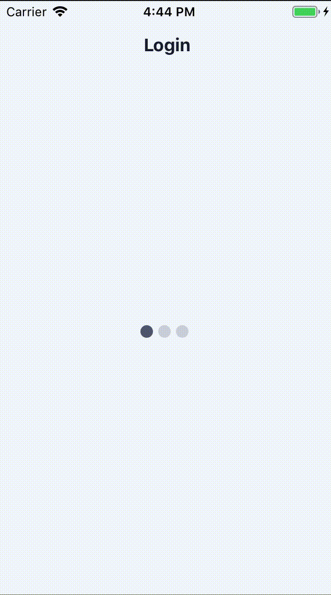

# react-native-loading-ellipsis

A simple, loading dots component like Airbnb loading. Ideal for everywhere.




## Installation

If using npm:

```
npm i react-native-loading-ellipsis
```

## Usage

```
import EllipsisLoading from 'react-native-loading-ellipsis'
```

Simply place a `<EllipsisLoading />` inside of any compnent.

```
<View style={{ flex: 1 }}>
    <EllipsisLoading />
</View>
```

### Styling Usage
EllipsisLoading is fully customizable using the `styleDot, animationDelay, numberOfDots,  minOpacity, and dotSize` props.

Example usage to change dots color:

```
const styleDot = {
    backgroundColor: '#000000',
    marginRight: 3,
};

return (
    <View style={{flex: 1}}>
        <EllipsisLoading styleDot={styleDot} />
    </View>
)
```

## Documentation

### EllipsisLoading Component
| Name                      | Description                              | Default     | Type   |
|---------------------------|------------------------------------------|-------------|--------|
| styleDoT                  | Dot styles                               | Object      | Object |
| animationDelay            | Delay for animation in milliseconds      | 300         | Number |
| numberOfDots              | Number of dot to display                 | 3           | Number |
| minOpacity                | Opacity of dot animatino                 | 0.2         | Number |
| dotSize                   | Size of the dots                         | 12          | Number |

## Contributing
Pull requests are always welcome! Feel free to open a new GitHub issue for any changes that can be made.

## Author
Janid Ham | [https://janidham.com](https://janidham.com)

## License
[MIT](./LICENSE)

<style>.bmc-button img{width: 27px !important;margin-bottom: 1px !important;box-shadow: none !important;border: none !important;vertical-align: middle !important;}.bmc-button{line-height: 36px !important;height:37px !important;text-decoration: none !important;display:inline-flex !important;color:#ffffff !important;background-color:#FF813F !important;border-radius: 3px !important;border: 1px solid transparent !important;padding: 1px 9px !important;font-size: 22px !important;letter-spacing:0.6px !important;box-shadow: 0px 1px 2px rgba(190, 190, 190, 0.5) !important;-webkit-box-shadow: 0px 1px 2px 2px rgba(190, 190, 190, 0.5) !important;margin: 0 auto !important;font-family:'Cookie', cursive !important;-webkit-box-sizing: border-box !important;box-sizing: border-box !important;-o-transition: 0.3s all linear !important;-webkit-transition: 0.3s all linear !important;-moz-transition: 0.3s all linear !important;-ms-transition: 0.3s all linear !important;transition: 0.3s all linear !important;}.bmc-button:hover, .bmc-button:active, .bmc-button:focus {-webkit-box-shadow: 0px 1px 2px 2px rgba(190, 190, 190, 0.5) !important;text-decoration: none !important;box-shadow: 0px 1px 2px 2px rgba(190, 190, 190, 0.5) !important;opacity: 0.85 !important;color:#ffffff !important;}</style><link href="https://fonts.googleapis.com/css?family=Cookie" rel="stylesheet"><a class="bmc-button" target="_blank" href="https://www.buymeacoffee.com/janidham"><span style="margin-left:5px">Buy me a coffee</span></a>